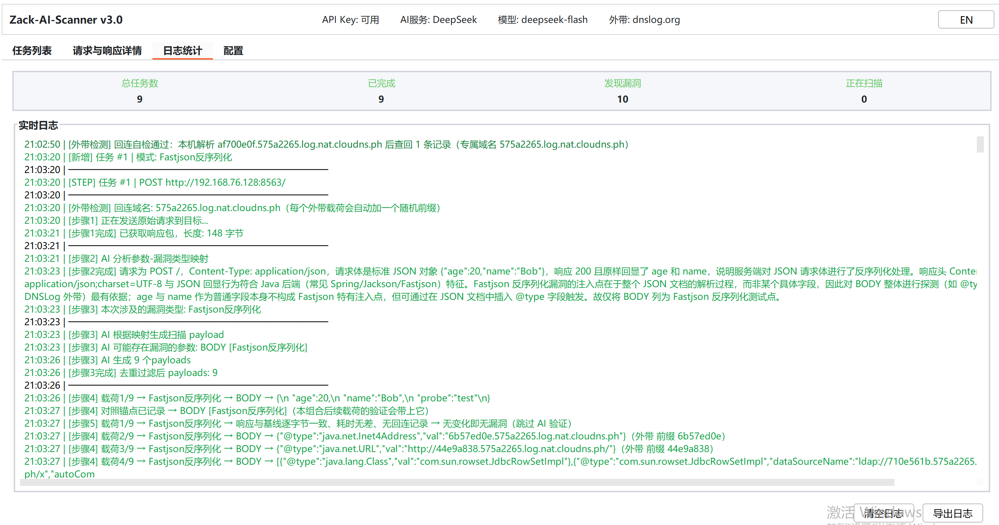
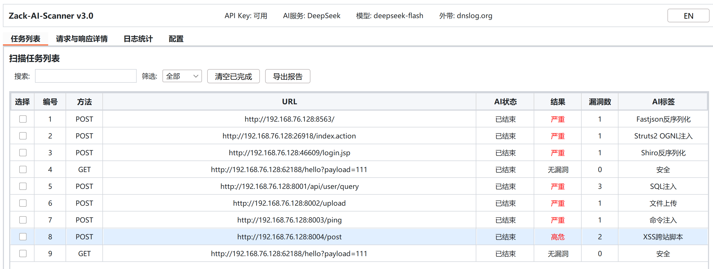
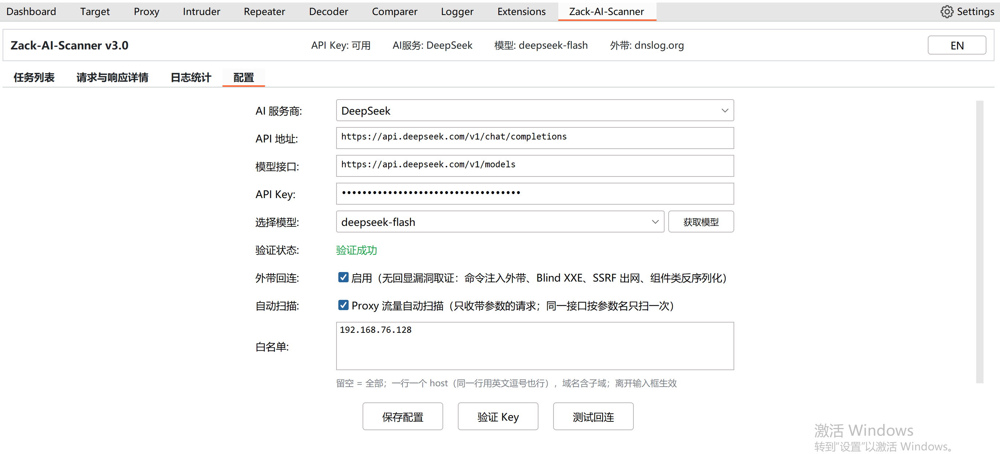
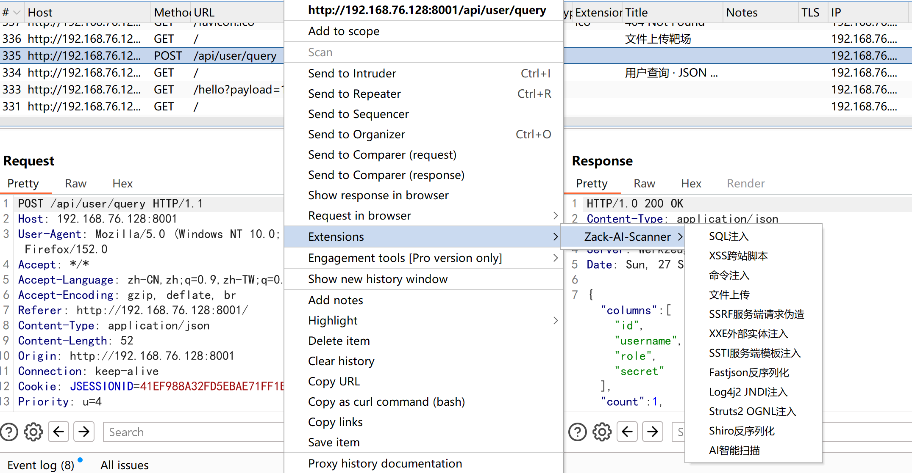
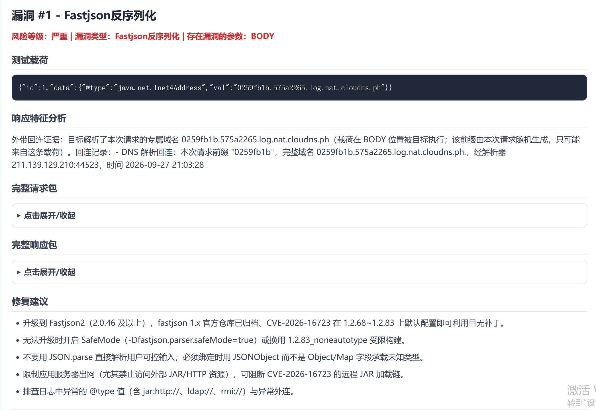

# Zack-AI-Scanner

[English](README.md) | **中文**

> Burp Suite 的 AI 智能漏洞扫描插件：右键把请求交给它，或开启「Proxy 流量自动扫描」（默认关闭）
> 让它自动接管带参数的代理流量 —— 由大模型判断哪些参数值得打、该用什么载荷，载荷真正发出去，
> 最后依据证据判断目标到底能不能被利用。结果落进任务表格，可导出 HTML / Markdown 报告。


---

## ⚠️ 免责声明（请先读这一段）

- **只允许用于你本人拥有、或已获得书面授权测试的目标。** 未授权扫描/攻击他人系统在绝大多数
  司法辖区都是违法的。
- **外带回连（OOB）默认开启。** 开启时，被扫描的目标会向第三方服务 `dnslog.org` 发起 DNS 查询
  —— 盲命令注入、盲 XXE、SSRF 出网，以及 Log4j2 / Fastjson / Struts2 / Shiro 这几类，都是靠它
  确认的。**你自己的机器也会访问这个服务**：插件加载时会在后台真跑一遍往返（确认这条链路可用），
  之后每次点**「测试回连」**还会再跑一次。如果场景不允许目标或本机对外发起请求，请在**「配置」**页
  关掉它（关掉后加载时不会再发任何请求）。代价是：这几类漏洞只能记成「未判定」。
- **你的请求与响应会被发给你配置的大模型服务商**（截取其中一部分作为判断依据）。请自行确认这
  不违反你的数据合规要求。
- 本程序按 GPLv3 分发，**不提供任何担保**。使用它产生的任何后果由使用者自负。

---

## 目录

- [它能做什么](#它能做什么)
- [原理](#原理)
- [环境要求](#环境要求)
- [构建](#构建)
- [安装](#安装)
- [快速上手](#快速上手)
- [配置项](#配置项)
- [扫描模式](#扫描模式)
- [外带回连（OOB）检测](#外带回连oob检测)
- [Proxy 自动扫描](#proxy-自动扫描)
- [报告](#报告)
- [许可证](#许可证)

## 它能做什么

对一个你手上的请求（Proxy 历史、Repeater、Target），选一个具体漏洞类型，或选**「AI智能扫描」**
让模型自己判断。插件随即对**这一个请求**跑一条分阶段的大模型流水线，通过 Burp 真正把载荷发出去，
再依据证据报告结论。

它**不是**爬虫，也**不是** Burp Scanner 的替代品：它不枚举端点、不做模糊测试。它做的是拿一个你
已经有的请求，问模型两个问题——**这里有什么值得测**、**这个响应能不能证明打成功了**——然后用
真实发包去验证这个答案。



注入点不限于 Burp 报出来的参数：一个位置可以是查询串 / 请求体 / cookie 的值、嵌套 JSON 路径
（`user.id`）、multipart 部件（含真正的二进制上传）、自定义请求头、REST 路径段，或整段 body
（XML / GraphQL）。有两类**故意不打**：逐跳请求头（`Host`、`Content-Length`、`Connection` 等）与
令牌类参数（`csrf`、`token`、`timestamp`、`nonce`、`signature` 等）。

## 原理

### 流水线

```
右键一个请求
  │
  ├─ 步骤1  通过 Burp 重放该请求，拿到一个活响应。
  │         这个响应就是后续一切对比的基线。重放与后面发载荷一样有 10 秒上限
  │         （目标不响应就按「无响应」收尾，不会一直卡着）。
  │
  ├─ 步骤2  → 模型：请求（请求行 + 全部请求头、请求体前 10000 字符）与响应
  │         （状态行 + 全部响应头、响应体前 10000 字符），外加可注入的参数名列表。
  │         ← 模型：{analysis, paramVulnMap:[{param, vulnTypes[], reason}]}
  │         这张表就是本次扫描的「范围」：空表直接以「安全」结束，一个包都不发。
  │         每次扫描一次调用。
  │
  ├─ 步骤3  → 模型：与步骤2 完全相同的请求/响应数据、paramVulnMap，以及一行
  │         从步骤1 响应猜出的后端指纹。
  │         ← 模型：{testPayloads:[{type, payload, position, kind, wafBypass}]}，每组合 9 条。
  │         `kind` 取 probe / attack / bypass —— 代码靠它认出「哪一条能当本组合的对照载荷」
  │         （见「为什么载荷数是这个数」）。代码侧再过滤、去重、逐个校验注入点，然后才发。
  │         每次扫描一次调用。
  │
  ├─ 步骤4  逐条注入发包，一次一条。
  │
  ├─ 步骤5  外带载荷不阻塞：挂到定时器上，6 秒后按它自己的随机前缀回查；
  │         其余载荷当场验证。
  │
  └─ 步骤6  → 模型：载荷、实测耗时与基线耗时、回连带、本次测试请求、本次测试响应、基线响应，
             以及**同一组合第 1 条载荷（探测载荷）的响应**（四段各前 10000 字符，围绕证据位置截取；
             探测载荷的作用见「为什么载荷数是这个数」）。
             ← 模型：{vulnerable, confidence, vulnType, level, description, tag}
             结论已经确定的载荷**不花调用**：有回连记录的、Struts2 算术求值成立的、以及与基线
             分不出差异的（见取舍 3）。其余每条载荷一次调用，所以 9 条载荷的扫描往往远少于 9 次。
```

### 三个决定结果形态的设计取舍

**1. 报告的闸门是硬的。** 只有 `vulnerable == true` **且**置信度 ≥ **95** 才记成漏洞。模型给的
90 分判断不会被报出来。内置的验证提示词里写的是同一个数字，所以代码与提示词不会悄悄漂移。

**2. 能在代码里下结论的，就不交给模型。**

- **外带回连。** 每条载荷都带一个随机的 8 位十六进制前缀，所以一条回连记录就是**不可伪造**的
  证据：确实是**这一次**请求让目标解析了我们的域名。记录一到就直接判定，置信度 100 —— 由代码
  下结论，不会被模型的犹豫否掉。
- **Struts2 算术求值。** 形如 `%{a*b}` 的载荷，其乘积出现在本次响应里、而基线里没有，就说明
  服务端真的算了这个式子。同样由代码判定。

两者共同的道理：这是这个工具能拿到的**最廉价、最客观**的两类证据，把它们绕一圈交给模型，既多花
一次调用，又多一份判错的风险。

**3. 「没有证据」绝不能被当成「不存在」的证据。** 当响应与基线一致、耗时差值可忽略、没有回连记录，
**且与同组合第 1 条载荷（探测载荷）的响应也一致**时，结论其实已经确定了——这条载荷会被**跳过、
且不花模型调用**，因为让模型去判断一个毫无变化的响应，只会诱发它编出一个理由。（「与基线一致」
是按**剥离易变响应头之后**的内容算的：Date 这类字段每秒都在变，不剥掉的话这条规则永远不会成立。）
反过来说，当一次回连**查询失败**（通道不可用）时，这条载荷记为**未判定**，绝不记为「无漏洞」
——查询失败不是反向证据。

### 为什么载荷数是这个数

每个（参数 × 漏洞类型）组合给 **9 条载荷**：1 条非破坏性的探测载荷、4 条主攻、4 条 WAF 绕过。

探测载荷不是走过场：**插件会把它的响应作为同一组合其余载荷的对照**，一起交给验证模型。布尔盲注那类
漏洞要看「恒真」与「恒假」两条的差异才判得出来，而这两条本来是在两次互相看不见的调用里分别判的 ——
只与基线一致、却与对照不同的载荷，恰恰是这类漏洞的证据形态。

如果**探测载荷自己被判成了漏洞**（少数类型里，能证明漏洞的那个值恰好也是最自然的第一条），这个对照会被
作废 —— 一份利用成功的产物不能当"正常响应"的参照。模型明确标成 `attack` / `bypass` 的载荷同样**绝不**
当对照，不管它排在第几条。

每种类型的指南自带它的探测载荷与绕过清单；目标的**后端语言**会从步骤1 的响应里做指纹识别，好让文件
上传类载荷用对后缀。

## 环境要求

| | |
|---|---|
| Burp Suite | 能加载 Java 扩展的版本（Extender API 2.3） |
| JDK | 17 或更高（构建用；产出的字节码目标为 17） |
| Maven | 3.6+ |
| 大模型 | 一个 API Key：OpenAI / Anthropic / 通义千问 / 智谱 / Kimi / DeepSeek / MiniMax —— 或任何 OpenAI 兼容端点（Ollama、vLLM 等），选**「自定义」** |

## 构建

```bash
mvn clean package
# → target/Zack-AI-Scanner-v3.0.jar    （gson 与 okhttp 已 shade 进包内）
```

## 安装

Burp → **Extender → Extensions → Add** → Extension type 选 **Java** → 选中那个 JAR。

加载成功后，Extender 的 Output 里会打印版本横幅与版权声明，主界面多出一个 **Zack-AI-Scanner** 标签页。

## 快速上手

1. 打开**「配置」**页，选服务商、填 API Key，点**「验证 Key」**——没验证过之前**「保存配置」**
   按钮是灰的——然后点**「保存配置」**。
2. 在 Proxy history / Repeater / Target 里右键任意请求 → **Zack-AI-Scanner** → 选一个漏洞类型，
   或选**「AI智能扫描」**。
3. 在**「任务列表」**页看进度与结果。双击某行看每个载荷的**「请求与响应详情」**；勾选若干行可批量
   删除 / 暂停 / 继续，或导出报告。同时只跑 10 个任务，其余排队并显示位次（`排队中 3/12`）。



顶栏始终显示 API Key 状态、当前服务商/模型，以及外带回连是开着还是**已关闭**。最右边的
**EN / 中文**按钮切换整个界面——菜单、标签页、日志与报告（AI 提示词仍是中文）；没点过时跟随
操作系统语言，点过之后按你的选择记住。

## 配置项

所有配置都在**「配置」**页上——没有弹窗，别处也没有配置入口。

| 配置 | 说明 |
|---|---|
| 服务商 / API 地址 / 模型 | 7 个预设 +**「自定义」**。**「获取模型」**可以直接从服务商拉取模型列表 |
| API Key | 明文保存在 `~/.zack-ai-scanner-config.json`，文件权限 `0600`。把它当机密对待：别提交、别共享。本版改了文件名，**旧文件名不再读取** —— 升级后需要重新配置一次 |
| 外带回连 | 默认开启 —— 见上方免责声明 |
| Proxy 自动扫描 + 白名单 | 默认关闭。白名单为空表示「全部」；填 `example.com` 会连同其子域一起匹配 |



三个值得知道的行为：

- **保存以验证为前提。** 没验证过的 Key 存不下去。
- **验证会立刻写盘**，与 Save 按钮无关，所以验证失败会如实持久化成「未验证」，而不是看起来已经配好了。
- **开关立即生效。** 拨动外带回连开关或自动扫描勾选框会当场写入配置文件——界面显示与扫描行为不允许
  出现分歧。

配置文件是原子写入的（临时文件 + `ATOMIC_MOVE`，权限 `0600`）。万一它损坏了，会被改名成
`~/.zack-ai-scanner-config.json.corrupt` 并大声报错，而不是被悄悄丢弃。

## 扫描模式

11 个具体类型，外加**「AI智能扫描」**：

| 模式 | 探测什么 |
|---|---|
| SQL注入 | 报错型、布尔盲注（`AND 1=1` vs `AND 1=2`）、时间盲注、`UNION`、堆叠查询 |
| XSS跨站脚本 | 反射型与存储型，是否在可执行上下文里未编码回显 |
| 命令注入 | 分隔符 / 管道 / 命令替换，时间盲注，以及 DNS 外带 |
| 文件上传 | 后缀与 MIME 绕过，语言按目标指纹选择 |
| SSRF服务端请求伪造 | 本机、内网段、云元数据、协议走私、DNS 外带 |
| XXE外部实体注入 | 文件读取、OOB DTD 加载、XInclude、元数据访问 |
| SSTI服务端模板注入 | 先定引擎（`{{7*7}}` 与 `{{7*'7'}}` 对照），再用引擎专属链 |
| Fastjson反序列化 | `@type` DNS 探测、JNDI 链、嵌套字段形态 |
| Log4j2 JNDI注入 | `${jndi:dns://…}` 及 2.15+ 的关键字绕过变体 |
| Struts2 OGNL注入 | S2-045/059/061/062/069 —— 请求头、参数，以及算术求值证明 |
| Shiro反序列化 | 先探 `deleteMe` 判断用法，再用逐载荷密钥做 Shiro-550 |

**Shiro 是特殊的**：cookie 值是 `Base64(IV ‖ AES-CBC(序列化 gadget))`，这不是模型能算出来的。模型
只输出一个标记，由插件用一个常见默认密钥把 **URLDNS gadget**（只触发一次 DNS 解析，不执行任何代码）
加密成真正的 cookie 值。有回连记录即同时证明了两件事：**密钥正确**且**反序列化被执行**。



## 外带回连（OOB）检测

有些漏洞在响应里什么都不留下。对它们来说，**目标解析了我们控制的域名**，这件事本身就是证据。

- 插件每个 Burp 会话向 **dnslog.org** 申请一个回连域名，并给每条载荷分配自己的随机 8 位十六进制
  前缀，因此多个并发任务共用一个域名也不会串号。
- 轮询是**延后而非阻塞**的：载荷发出去，扫描继续走，6 秒后由该扫描自己的守护线程回查。查到记录
  就直接在代码里生成结论。
- **每条载荷只查一次，在它发出 6 秒后。** 记录要先经目标的递归解析器，所以发完立刻查基本是空的；
  6 秒就是全部窗口，**不重试**。传播慢于这个时间的记录就查不到了 —— 那条载荷接下来怎么处理取决于
  响应：与基线分不出差异的记「无漏洞」（见取舍 3），有一丁点差异的交给模型，并告诉它通道查空了。
  无论哪一种，它都不会被报成漏洞。
- 回连通道**不可用**的载荷记为**未判定**，绝不记为「无漏洞」—— 包括模型只凭响应回答「没漏洞」的情况。

**OPSEC 提醒。** 开启外带回连时，被扫描的目标会与第三方服务通信。有些项目里这是不可接受的——这正是
这个开关存在的理由。关掉之后，插件会彻底避免发送携带回调域名的载荷，目标根本不会去联系那个服务；
代价是 Log4j2 / Fastjson / Struts2 / Shiro 这几类最高只能记成「未判定」。

**「测试回连」**按钮会真的跑一遍往返（申请域名 → 本机解析它 → 再查回来）。如果你的机器 DNS 被
代理/VPN 劫持（Clash 那类假 IP 解析器对任何域名都给同一个地址），测试会明确指出这一点，**并且会告诉你
这不代表扫描坏了**——扫描时解析回调域名的是**目标**，不是你的机器。

## Proxy 自动扫描

默认关闭。开启后，每一条**带参数的**请求经过 Burp Proxy 都会自动变成一个扫描任务，于是正常浏览网页
就自己攒出一个扫描队列。

- **只有带参数的请求算数。** 图片、CSS、JS、favicon 以及无参数的 REST 路径会被静默跳过，而不是排进
  队列、最后以「安全」收场。
- **Cookie 被有意排除在闸门之外。** Burp 会把每个 cookie 都报成参数，算上它们会让登录态网站上的每一张
  图片都「有参数」——恰好是噪音最大的地方。只以 cookie 为注入面的请求仍然可以右键扫描。
- **重复请求会被跳过**，判重键是 `host:port + 方法 + 路径 + 参数名集合`，其中每个名字都带位置前缀
  （`url:id` 与 `body:id` 是两个不同的注入面，不会并成一条）。参数**值**与请求头不参与：值会轮换
  （时间戳、随机数、页码），请求头更是每条都不同，算进去会让每次访问都像新请求。这个取舍说明白：
  `?id=1` 与 `?id=2'` 算同一个请求，测的是先看到的那个值。
- **手动扫描从不判重。** 右键 → 选类型，永远是「就扫这一个请求，一次」。

把勾选框关掉再打开可以重新武装判重（比如换了目标之后）。

## 报告

每个任务可导出 **HTML** 与 **Markdown**，内容含载荷、证据、完整请求响应，以及按类型给出的修复建议。
HTML 的字段与 Markdown 的代码围栏都做了转义/加长处理，所以攻击者可控的响应内容无法从自己的块里逃逸
出来，也无法在顾问打开的渲染器里伪造标题。



报告语言跟随界面语言（顶栏的 **EN / 中文** 按钮）。

## 许可证

本项目以 **GNU General Public License v3.0 or later**（GPL-3.0-or-later）发布，全文见 [LICENSE](LICENSE)。

```
Copyright (C) 2026 Zack AI Scanner

This program is free software: you can redistribute it and/or modify
it under the terms of the GNU General Public License as published by
the Free Software Foundation, either version 3 of the License, or
(at your option) any later version.

This program is distributed in the hope that it will be useful,
but WITHOUT ANY WARRANTY; without even the implied warranty of
MERCHANTABILITY or FITNESS FOR A PARTICULAR PURPOSE.  See the
GNU General Public License for more details.
```

构建出的 JAR 里打包了若干 **Apache-2.0** 组件（gson、okhttp、okio、Kotlin 标准库），它们的署名与许可证
全文见 [THIRD-PARTY-NOTICES.md](THIRD-PARTY-NOTICES.md)。

`burp-extender-api` 是 PortSwigger 的**专有**许可。本项目只在编译期使用它（`provided` 作用域）：
**没有**把它打进 JAR，也**没有**在本仓库内分发——运行时由 Burp Suite 自己提供。使用 Burp Suite 请遵守
PortSwigger 的许可条款。
