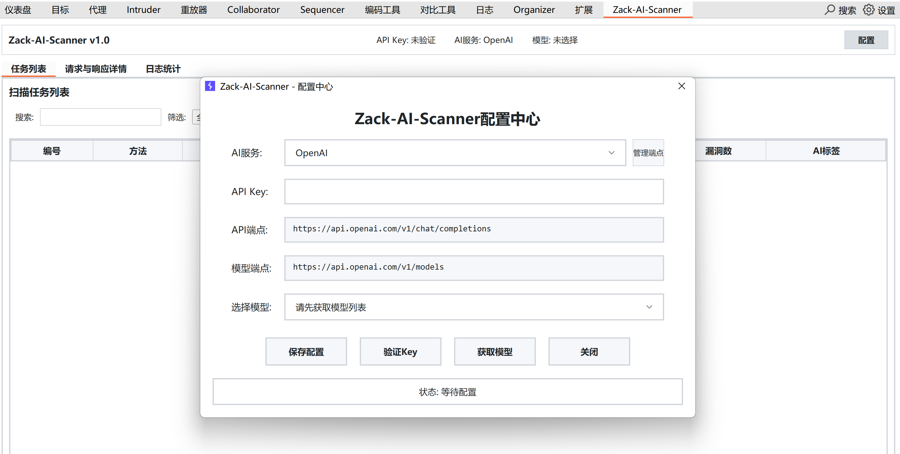
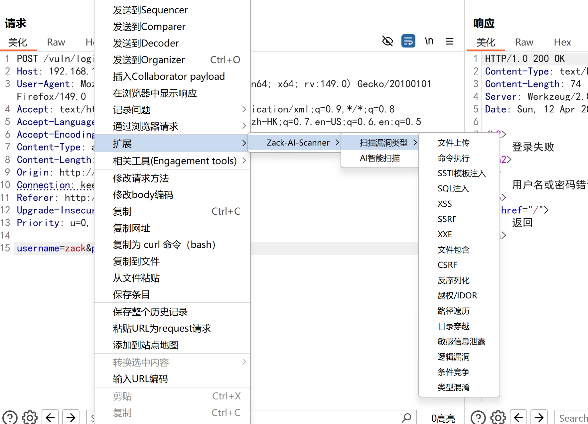
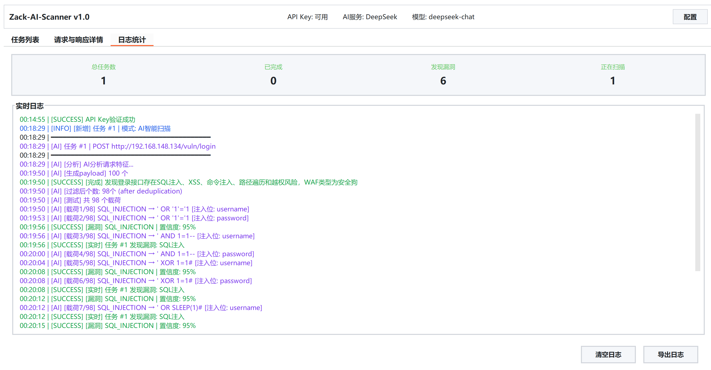
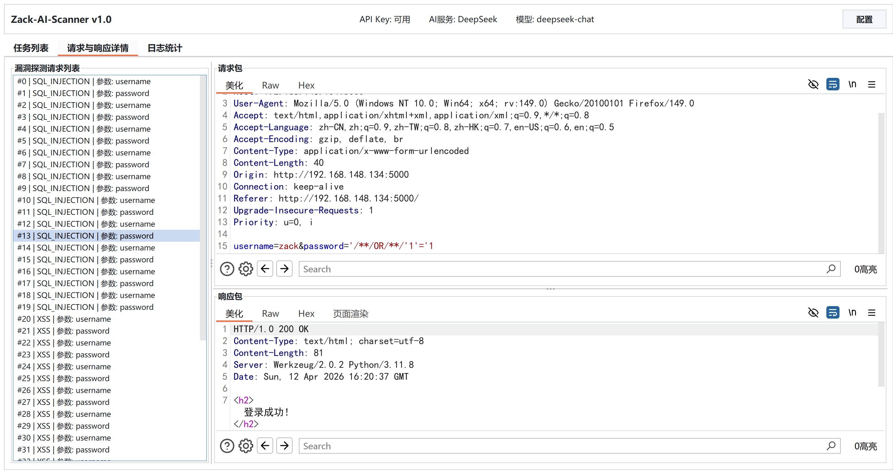
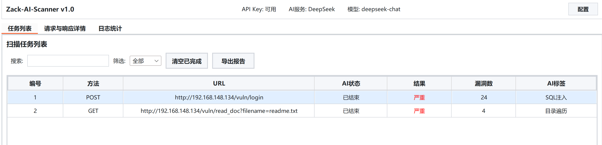
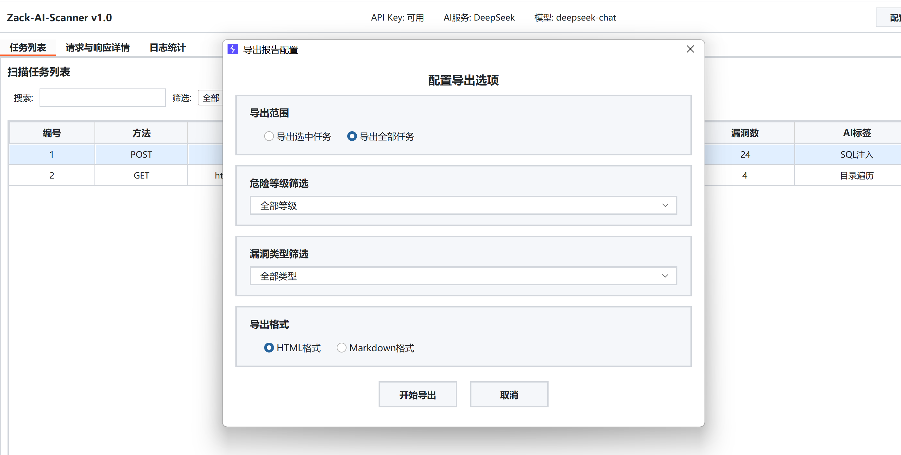
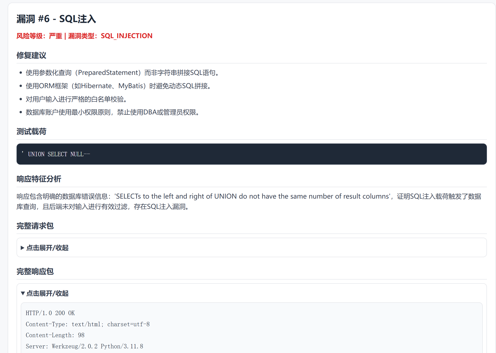
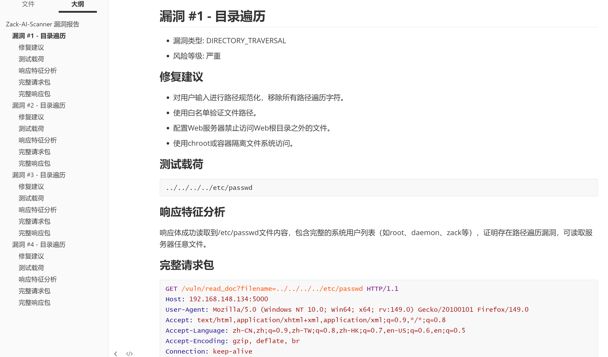

# Zack-AI-Scanner Readme

## 项目概述

Zack-AI-Scanner 是一款基于大语言模型的自动化 Web 漏洞扫描工具，作为 Burp Suite 扩展运行。通过 AI 深度学习技术自动分析 HTTP 请求特征，智能识别潜在安全漏洞，动态生成针对性测试Payload，并智能验证漏洞真实性。

## 核心功能

- **AI 智能扫描**: 内置 Skills 利用 LLM 自动分析请求并制定测试策略
- **多漏洞类型支持**: 支持 17 种常见 Web 漏洞类型的检测
- **WAF 绕过能力**: 内置 Prompt 多种 WAF 绕过技术，50% 载荷为绕过载荷
- **实时结果验证**: AI 二次验证确保漏洞真实性（置信度阈值 ≥90%）
- **多格式报告导出**: 支持 HTML 和 Markdown 格式的渗透测试报告

## 技术栈

| 组件 | 技术选型 |
|------|----------|
| 开发语言 | Java 17 |
| 构建工具 | Maven (maven-shade-plugin) |
| 扩展框架 | Burp Extender API 2.3 |
| JSON 处理 | Gson 2.10.1 |
| HTTP 客户端 | OkHttp3 4.12.0 |
| GUI 框架 | Swing (Java 内置) |
| 配置存储 | JSON 文件 (~/.zackai_config.json) |

## 支持的漏洞类型

| 漏洞类型 | 说明 |
|----------|------|
| SQL_INJECTION | SQL 注入 |
| XSS | 跨站脚本攻击 |
| COMMAND_INJECTION | 命令注入 |
| FILE_UPLOAD | 文件上传漏洞 |
| SSRF | 服务端请求伪造 |
| XXE | XML 外部实体注入 |
| FILE_INCLUDE | 文件包含漏洞 |
| SSTI | 模板注入 |
| CSRF | 跨站请求伪造 |
| DESERIALIZATION | 反序列化漏洞 |
| AUTH_BYPASS | 越权/认证绕过 |
| PATH_TRAVERSAL | 路径遍历 |
| DIRECTORY_TRAVERSAL | 目录穿越 |
| SENSITIVE_DATA_EXPOSURE | 敏感信息泄露 |
| LOGIC_FLAW | 逻辑漏洞 |
| RACE_CONDITION | 条件竞争 |
| TYPE_CONFUSION | 类型混淆 |

## 支持的 AI 服务提供商

- OpenAI (GPT-4, GPT-3.5)
- Anthropic (Claude)
- Google Gemini
- Azure OpenAI
- 通义千问 (阿里云)
- 文心一言 (百度)
- 智谱 AI (GLM)
- Kimi (月之暗面)
- DeepSeek
- 讯飞星火
- 字节豆包
- 腾讯混元
- 百川智能
- MiniMax
- 零一万物
- 阶跃星辰

## 快速开始

### 安装

1. 构建项目: `mvn clean package`
2. 在 Burp Suite 的 Extender 标签页加载生成的 JAR 文件

### 配置

1. 点击 "配置" 按钮打开配置中心
2. 选择 AI 服务提供商并输入 API Key
3. 点击 "获取模型" 按钮获取可用模型列表
4. 保存配置后即可开始使用

### 使用

1. 在 Burp Suite 的 Proxy 或其他模块中选择 HTTP 请求
2. 右键点击，选择 "Zack-AI-Scanner" 菜单
3. 选择扫描模式（AI 智能扫描或特定漏洞类型）
4. 在主面板查看扫描进度和结果
5. 导出漏洞报告

## 目录结构

```
src/main/java/com/zackai/
├── AISentryExtender.java    # Burp 扩展主入口
├── core/                    # 核心功能模块
│   ├── AIEngine.java        # AI 扫描引擎
│   └── ConfigManager.java   # 配置管理器（单例）
├── model/                   # 数据模型
│   ├── ScanTask.java        # 扫描任务模型
│   ├── VulnResult.java      # 漏洞结果模型
│   └── AIProvider.java      # AI 服务提供商模型
├── ui/                      # UI 组件
│   ├── MainPanel.java       # 主面板
│   ├── TaskTablePanel.java  # 任务表格
│   ├── TaskDetailPanel.java # 任务详情
│   ├── LogPanel.java        # 日志面板
│   ├── ConfigDialog.java    # 配置对话框
│   ├── ExportDialog.java    # 导出对话框
│   ├── EndpointManagerDialog.java  # 端点管理
│   ├── PromptPanel.java     # 提示词管理
│   └── HelpPanel.java       # 帮助面板
└── util/                    # 工具类
    └── ReportGenerator.java # 报告生成器
```

## 插件使用实例

配置大模型API Key信息：



右击请求包->拓展->Zack-AI-Scanner调用工具，可选择AI智能扫描和单漏洞扫描：



日志统计窗口可实时查看扫描信息：



请求与响应详情窗口可以查看实时的扫描流量：



在任务列表窗口可以查看所有扫描任务和状态，扫描结束导出漏洞报告，支持 HTML 和 Markdown 格式：





HTML 和 Markdown 格式报告内容：





## 免责声明

本工具仅供教育和授权测试使用！旨在帮助安全研究人员、渗透测试人员和IT专业人员在**获得明确授权**的情况下进行安全评估和漏洞研究。

**使用本工具即表示您同意：**

- 仅在您拥有明确书面授权的系统上使用此工具
- 遵守所有适用的法律法规和道德准则
- 对任何未经授权的使用或滥用行为承担全部责任
- 不会将本工具用于任何非法或恶意目的

**开发者不对任何滥用行为负责！** 请确保您的使用符合当地法律法规，并获得目标系统所有者的明确授权。

本项目基于 GNU General Public License v3.0 (GPL v3) 许可证开源。
您可以在遵守 GPL v3 条款的前提下，自由使用、修改、复制或分发本项目的代码（禁止商业用途），但任何修改后的版本或衍生作品也必须同样以 GPL v3 许可证开源，并附上完整的源代码和版权声明。


