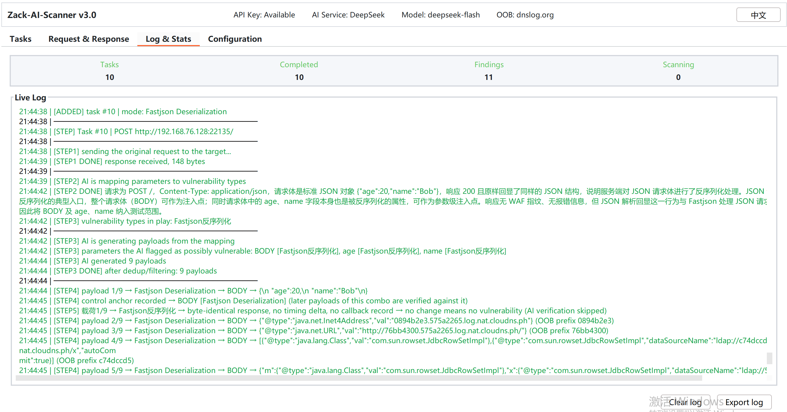
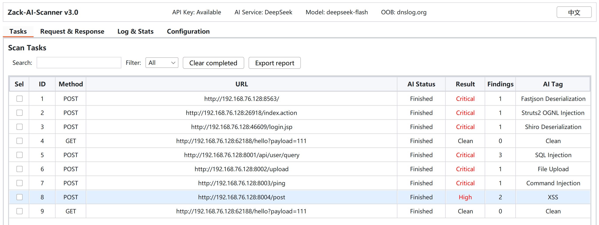
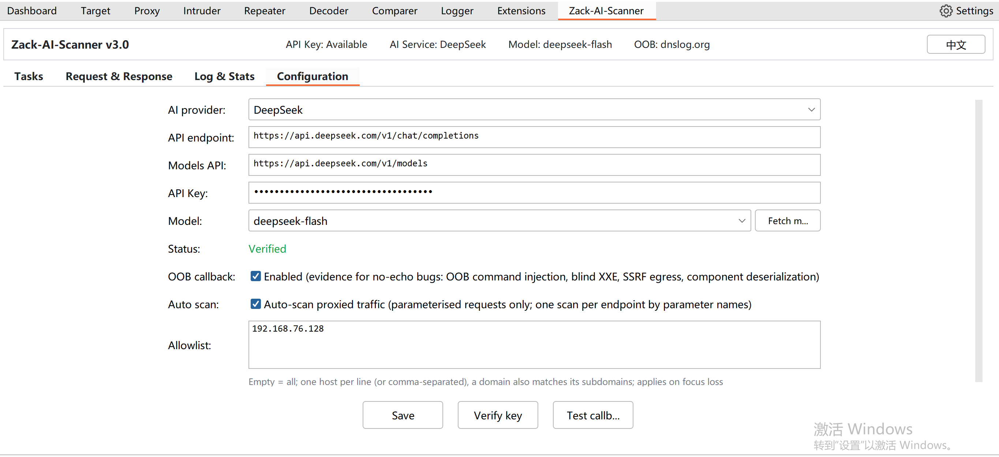
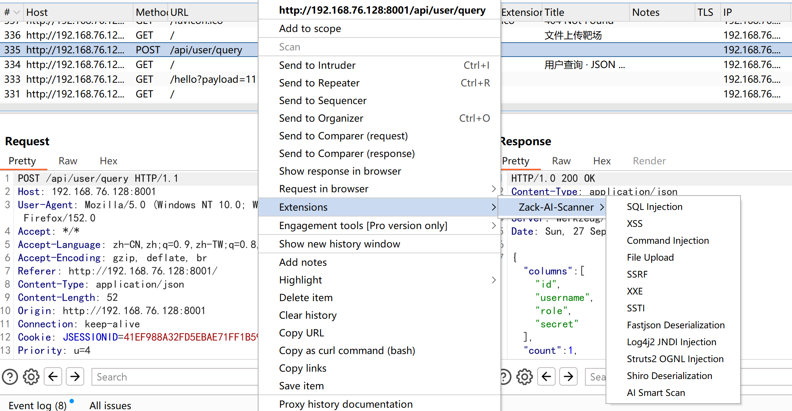
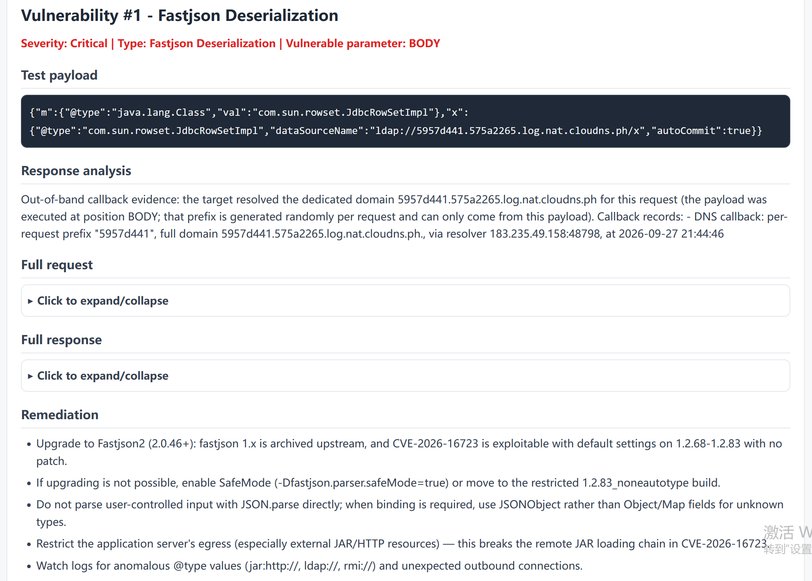

# Zack-AI-Scanner

**English** | [中文](README-CN.md)

> A Burp Suite extension that puts an LLM-driven vulnerability scan behind a right-click — or behind
> Proxy auto-scan (off by default), which turns parameterised proxy traffic into scan tasks. The model
> picks which parameters to attack and with what payloads; the payloads are really sent, and
> exploitability is decided from the evidence. Findings land in a task table and export to
> HTML / Markdown reports.


---

## ⚠️ Disclaimer — read this first

- **Use this only against systems you own or have written authorisation to test.** Unauthorised
  scanning or attacking of systems you do not own is illegal in most jurisdictions.
- **Out-of-band (OOB) detection is ON by default.** With it enabled, the targets you scan will send
  DNS queries to a third-party service (`dnslog.org`) — that is how blind command injection, blind
  XXE, SSRF egress and the Log4j2 / Fastjson / Struts2 / Shiro classes are confirmed. **Your own
  machine talks to that service too**: once when the extension is loaded (a real round trip, run in
  the background to check the channel works) and again every time you press **Test callback**. If
  the engagement forbids either, turn it off on the **Configuration** tab — with it off nothing
  leaves your machine on load, and the cost is that those vulnerability classes can then only be
  recorded as *not judged*.
- **Your requests and responses are sent to the LLM provider you configure** (partially, as evidence
  for the model to reason over). Make sure that does not violate your data-handling rules.
- This program is distributed under the GPLv3 **without any warranty**. You are responsible for the
  consequences of using it.

---

## Table of contents

- [What it does](#what-it-does)
- [How it works](#how-it-works)
- [Requirements](#requirements)
- [Build](#build)
- [Install](#install)
- [Quick start](#quick-start)
- [Configuration](#configuration)
- [Scan modes](#scan-modes)
- [Out-of-band (OOB) detection](#out-of-band-oob-detection)
- [Proxy auto-scan](#proxy-auto-scan)
- [Reports](#reports)
- [License](#license)

## What it does

Point it at a request (Proxy history, Repeater, Target) and pick either a specific vulnerability type
or **AI Smart Scan** to let the model decide. The extension then runs a staged LLM pipeline against
that one request, sends real payloads through Burp, and reports what the evidence supports.

It is **not** a crawler and **not** a replacement for Burp Scanner: it does not enumerate endpoints,
and it does not fuzz. It takes a request you already have and asks a model two questions — *what is
worth testing here*, and *does this response prove it worked* — then verifies the answer by actually
sending packets.



Injection points are not limited to the parameters Burp reports: a mapped position may be a query /
body / cookie value, a nested JSON path (`user.id`), a multipart part (a real binary upload included),
a custom request header, a REST path segment, or the whole body (XML / GraphQL). Two things are
deliberately never injected into: hop-by-hop headers (`Host`, `Content-Length`, `Connection`, …) and
token-shaped parameters (`csrf`, `token`, `timestamp`, `nonce`, `signature`, …).

## How it works

### The pipeline

```
right-click a request
  │
  ├─ Step 1  Replay the request through Burp to get a live response.
  │          This response is the baseline everything else is compared against.
  │          The replay is capped at 10s, like the payloads below: an unresponsive
  │          target ends the task as "no response" instead of parking it.
  │
  ├─ Step 2  → model: the request (request line + all headers, body up to 10 000 chars)
  │          and the response (status line + all headers, body up to 10 000 chars),
  │          plus the parameter names considered injectable.
  │          ← model: {analysis, paramVulnMap:[{param, vulnTypes[], reason}]}
  │          That map is the SCOPE of the scan: an empty one ends the task as "safe"
  │          without sending a single packet. One call per scan.
  │
  ├─ Step 3  → model: the same request/response block, the paramVulnMap, and a one-line
  │          backend fingerprint guessed from the Step-1 response.
  │          ← model: {testPayloads:[{type, payload, position, kind, wafBypass}]}, 9 per combo.
  │          `kind` is probe / attack / bypass: it is how the code tells the one payload that may
  │          serve as a combo's control from the ones judged against it (see "Why payload counts
  │          matter"). The code then filters, de-duplicates and validates every injection point.
  │          One call per scan.
  │
  ├─ Step 4  Inject and send, one payload at a time.
  │
  ├─ Step 5  Out-of-band payloads do not block: they are handed to a timer and polled
  │          6 s later by their own random prefix. Everything else is judged inline.
  │
  └─ Step 6  → model: the payload, the elapsed time against the baseline's, the callback
             block, the test request, the test response, the baseline response, and the
             response of the combo's FIRST payload (the probe — see "Why payload counts
             matter") — four windows of 10 000 chars each, excerpted around the evidence.
             ← model: {vulnerable, confidence, vulnType, level, description, tag}
             Payloads whose verdict is already determined cost no call at all: a callback,
             a Struts2 arithmetic proof, or a response indistinguishable from the baseline
             (design decision 3). One call per remaining payload, so a 9-payload scan
             usually costs far fewer than nine.
```

### Three design decisions that shape the results

**1. A hard reporting gate.** A finding is only recorded when the verdict is
`vulnerable == true` **and** confidence ≥ **95**. A model's 90-point hunch is not reported. The
built-in verification prompt states the same number, so the code and the prompt cannot drift apart
silently.

**2. Where a verdict is decided in code, it is not delegated to the model.**

- **Out-of-band callbacks.** Every payload gets a random 8-hex prefix, so a callback record is
  unforgeable proof that *this* request made the target resolve our domain. A record that arrives is
  a finding at confidence 100 — decided in code, not by a model that might hesitate.
- **Struts2 arithmetic.** A payload shaped `%{a*b}` whose product appears in the test response but
  not in the baseline means the server really evaluated the expression. That is also decided in code.

The point of both: these are the two cheapest, most objective pieces of evidence the tool can get,
and routing them through a model would cost a call and risk a wrong answer.

**3. Absence of evidence must not be reported as evidence of absence.** When a response matches the
baseline, the timing delta is negligible, there is no callback **and the combo's probe payload came
back with the same response**, the verdict is already determined — the payload is skipped *without*
spending a model call, because asking a model to judge an unchanged response only invites it to
invent a reason. ("Matches the baseline" means *after volatile headers are stripped*: `Date` changes
every second, so a byte-for-byte comparison that includes it could never be true.) Conversely, when
an OOB poll *fails* (channel unavailable), the payload is recorded as **not judged** — never as
"no vulnerability" — because a failed lookup is not negative evidence.

### Why payload counts matter

Each (parameter, vulnerability type) combination gets **9 payloads**: 1 non-destructive probe,
4 primary attacks, and 4 WAF-bypass variants.

The probe is not a formality: **its response is carried into the verification of the combo's other
payloads as their control.** Boolean-blind injection can only be read from the *pair* ("true
condition" vs "false condition"), and those two payloads would otherwise be judged in calls that
cannot see each other — a payload that matches the baseline but differs from the control is exactly
what that class of evidence looks like. If the probe itself comes back vulnerable (for a few types a
response that proves the bug is also the natural thing to send first), the control is discarded —
an exploitation result cannot serve as the "normal" reference. A payload the model marked `attack` or
`bypass` is likewise never accepted as a control, wherever it sits in the combo.

The guide for each type ships its own probe payload and bypass list, and the target's backend
language is fingerprinted from the Step-1 response so that file-upload payloads use the right
extension.

## Requirements

| | |
|---|---|
| Burp Suite | Any version that can load Java extensions (Extender API 2.3) |
| JDK | 17 or newer (to build; the produced bytecode targets 17) |
| Maven | 3.6+ |
| LLM | An API key for OpenAI, Anthropic, Qwen, Zhipu, Kimi, DeepSeek or MiniMax — or any OpenAI-compatible endpoint (Ollama, vLLM, …) via **Custom** |

## Build

```bash
mvn clean package
# → target/Zack-AI-Scanner-v3.0.jar    (gson and okhttp are shaded in)
```

## Install

Burp → **Extender → Extensions → Add** → Extension type **Java** → select the JAR.

On success the Extender output prints a version banner and a copyright notice, and a
**Zack-AI-Scanner** tab appears in the main window.

## Quick start

1. Open the **Configuration** tab. Pick a provider, enter your API key, press **Verify key** — the
   **Save** button stays greyed out until a key has been verified — then **Save**.
2. In Proxy history / Repeater / Target, right-click a request →
   **Zack-AI-Scanner** → pick a vulnerability type, or **AI Smart Scan**.
3. Watch the **Tasks** tab. Double-click a row for the **Request & Response** detail of every
   payload, tick rows to delete / pause / resume them in bulk, or export a report. Ten scans run at
   once and the rest queue, showing their position (`Queued 3/12`).



The top bar always shows the API-key state, the active provider/model, and whether out-of-band
detection is on or **off**. The **EN / 中文** button at its right end switches the whole interface —
menus, tabs, logs and reports, but not the AI prompts, which stay Chinese; it follows the OS language
until you pick one, and the choice persists.

## Configuration

Everything lives on the **Configuration** tab — there is no modal dialog and no config button
anywhere else.

| Setting | Notes |
|---|---|
| Provider / API endpoint / Model | 7 presets plus **Custom**. **Fetch models** pulls the model list from the provider |
| API key | Stored in plaintext in `~/.zack-ai-scanner-config.json` with file mode `0600`. Treat it as a secret: do not commit it, do not share it. The file name changed in this version and the old name is **not** read — configure the extension again after upgrading |
| Out-of-band detection | On by default — see the disclaimer above |
| Proxy auto-scan + allowlist | Off by default. An empty allowlist means "everything"; `example.com` also matches its subdomains |



Three behaviours worth knowing:

- **Saving is gated on verification.** A key that has not been verified cannot be saved.
- **Verifying writes to disk immediately**, independently of the Save button, so a failed
  verification persists as "not verified" rather than silently looking configured.
- **Toggles apply immediately.** Flipping the OOB switch or the auto-scan checkbox writes the config
  file at once — the display and the scan behaviour are never allowed to disagree.

The config file is written atomically (temp file + `ATOMIC_MOVE`, mode `0600`). If it is ever found
corrupt, it is renamed to `~/.zack-ai-scanner-config.json.corrupt` and reported loudly instead of being
silently discarded.

## Scan modes

Eleven specific types plus **AI Smart Scan**:

| Mode | What it probes |
|---|---|
| SQL Injection | Error-based, boolean-blind (`AND 1=1` vs `AND 1=2`), time-blind, `UNION`, stacked queries |
| XSS | Reflected and stored, unescaped reflection in an executable context |
| Command Injection | Separator / pipe / substitution payloads, time-based, and DNS out-of-band |
| File Upload | Extension and MIME bypasses, language chosen from the target fingerprint |
| SSRF | Localhost, internal ranges, cloud metadata, protocol smuggling, DNS out-of-band |
| XXE | File read, OOB DTD fetch, XInclude, and metadata access |
| SSTI | Engine fingerprinting (`{{7*7}}` vs `{{7*'7'}}`) then engine-specific chains |
| Fastjson Deserialization | `@type` DNS probes, JNDI chains, nested-field forms |
| Log4j2 JNDI Injection | `${jndi:dns://…}` plus 2.15+ keyword-bypass variants |
| Struts2 OGNL Injection | S2-045/059/061/062/069 — headers, parameters, and arithmetic proof |
| Shiro Deserialization | `deleteMe` presence probe, then Shiro-550 with per-payload keys |

**Shiro is special**: the cookie value is `Base64(IV ‖ AES-CBC(serialized gadget))`, which no model
can compute. The model emits a marker, and the extension encrypts a URLDNS gadget (a DNS lookup
only — no code execution) with one of the well-known default keys. A callback proves *both* that the
key is correct and that deserialization happened.



## Out-of-band (OOB) detection

Some vulnerabilities produce no visible response at all. For those, the target resolving a domain we
control *is* the evidence.

- The extension acquires one callback domain per Burp session from **dnslog.org** and gives every
  payload its own random 8-hex prefix, so several concurrent tasks can share one domain without
  mixing up attribution.
- Polling is **deferred, not blocking**: the payload is sent, the scan moves on, and a per-scan daemon
  thread polls 6 s later. A record that arrives is turned into a finding directly in code.
- **One lookup per payload, six seconds after it is sent.** The record has to travel through the
  target's recursive resolver, so an immediate check reads back empty; six seconds is the whole
  window, and there is no retry. A record that propagates slower than that is simply missed — and
  what happens to that payload then depends on its response: indistinguishable from the baseline, it
  is recorded as *no vulnerability* (see design decision 3); changed at all, it goes to the model,
  which is told the channel came back empty. It is never reported *as a vulnerability*.
- A payload whose callback channel was **unavailable** is recorded as *not judged*, never as "no
  vulnerability" — including when the model, asked about the response alone, answers "not vulnerable".

**OPSEC note.** With OOB enabled, scanned targets talk to a third-party service. That may be
unacceptable in some engagements — which is exactly why the switch exists. With it off, the tool
avoids sending payloads that carry a callback domain at all, so the target never contacts the
service; the Log4j2 / Fastjson / Struts2 / Shiro classes then top out at "not judged".

The **Test callback** button performs a real round trip (acquire a domain → resolve it → poll it
back). If your machine's DNS is intercepted by a proxy/VPN (a fake-IP resolver answering for
everything), the test says so explicitly **and tells you that scanning is not broken** — during a
scan it is the *target* that resolves the callback domain, not your machine.

## Proxy auto-scan

Off by default. When enabled, every request crossing Burp Proxy that carries parameters becomes a
scan task, so ordinary browsing builds a scan queue by itself.

- **Only parameterised requests qualify.** Images, CSS, JS, favicon and parameter-less REST paths are
  skipped silently rather than queued up to end as "safe".
- **Cookies deliberately do not count** as parameters here. Burp reports every cookie as a parameter,
  so counting them would make every image on a logged-in site "have parameters" — exactly where the
  noise is worst. A request whose only injectable surface is a cookie can still be scanned by
  right-click.
- **Duplicates are skipped** by `host:port + method + path + parameter-name set`, where each name
  carries its position — `url:id` and `body:id` are two different injection surfaces, so they do not
  collapse into one entry. Parameter *values* and headers are not part of the key: values rotate
  (timestamps, nonces, page numbers) and headers are noisy, so including them would make every repeat
  look new. The trade-off is stated plainly: `?id=1` and `?id=2'` count as one request, and the first
  value seen is the one tested.
- **Manual scans are never de-duplicated.** Right-click → pick a type always means "scan this
  request, once", every time.

Turn the checkbox off and on again to re-arm the de-duplication (for example after switching targets).

## Reports

Each task exports to **HTML** and **Markdown**, including the payload, the evidence, the full request
and response, and per-type remediation advice. Both the HTML artifacts and the Markdown code fences
are escaped so that attacker-controlled response content cannot break out of its block or forge
headings in whatever viewer a consultant opens the report in.



Report language follows the UI language — the **EN / 中文** button in the top bar.

## License

Released under the **GNU General Public License v3.0 or later** (GPL-3.0-or-later). The full text is
in [LICENSE](LICENSE).

```
Copyright (C) 2026 Zack AI Scanner

This program is free software: you can redistribute it and/or modify
it under the terms of the GNU General Public License as published by
the Free Software Foundation, either version 3 of the License, or
(at your option) any later version.

This program is distributed in the hope that it will be useful,
but WITHOUT ANY WARRANTY; without even the implied warranty of
MERCHANTABILITY or FITNESS FOR A PARTICULAR PURPOSE.  See the
GNU General Public License for more details.
```

The built JAR bundles several **Apache-2.0** components (gson, okhttp, okio, the Kotlin standard
library). Their attribution and full licence texts are in
[THIRD-PARTY-NOTICES.md](THIRD-PARTY-NOTICES.md).

`burp-extender-api` is under PortSwigger's **proprietary** licence. This project uses it at compile
time only (`provided` scope): it is **not** bundled into the JAR and is **not** redistributed in this
repository — Burp Suite supplies it at runtime. Use of Burp Suite is subject to PortSwigger's terms.
